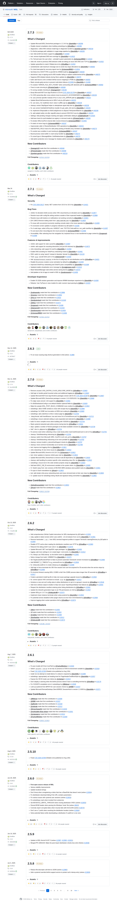

# Visited: https://github.com/microsoft/WSL/releases
**Time:** Mon May  4 20:14:49 UTC 2026

## Screenshot

## Raw HTML
[page.html](./page.html)

## Downloaded Media (10 files)
## Downloaded Media Files

## Other Links
- [#start-of-content](#start-of-content)
- [/](/)
- [/OneBlue](/OneBlue)
- [/login?return_to=%2Fmicrosoft%2FWSL](/login?return_to=%2Fmicrosoft%2FWSL)
- [/login?return_to=https%3A%2F%2Fgithub.com%2Fmicrosoft%2FWSL%2Freleases](/login?return_to=https%3A%2F%2Fgithub.com%2Fmicrosoft%2FWSL%2Freleases)
- [/manifest.json](/manifest.json)
- [/microsoft](/microsoft)
- [/microsoft/WSL](/microsoft/WSL)
- [/microsoft/WSL/actions](/microsoft/WSL/actions)
- [/microsoft/WSL/commit/0c8844e0f2f45e0e3f12c21d355d877a61adddf0](/microsoft/WSL/commit/0c8844e0f2f45e0e3f12c21d355d877a61adddf0)
- [/microsoft/WSL/commit/4b6b3884ba52c3e8c78f9500b5cdf6676b094026](/microsoft/WSL/commit/4b6b3884ba52c3e8c78f9500b5cdf6676b094026)
- [/microsoft/WSL/commit/5acd6004641ee063ed4d3043db6c6f919aaabda2](/microsoft/WSL/commit/5acd6004641ee063ed4d3043db6c6f919aaabda2)
- [/microsoft/WSL/commit/61e6b9aa8686b6a855070668455a163e83ec925c](/microsoft/WSL/commit/61e6b9aa8686b6a855070668455a163e83ec925c)
- [/microsoft/WSL/commit/6319b0268702a12e2d66cd37ae1495bfa4f5c009](/microsoft/WSL/commit/6319b0268702a12e2d66cd37ae1495bfa4f5c009)
- [/microsoft/WSL/commit/642331364dda7a3d88bf64acb87e7056918a5fc9](/microsoft/WSL/commit/642331364dda7a3d88bf64acb87e7056918a5fc9)
- [/microsoft/WSL/commit/c7aad6161166d330099cc48ceab7ee158b8225a2](/microsoft/WSL/commit/c7aad6161166d330099cc48ceab7ee158b8225a2)
- [/microsoft/WSL/commit/e1acbd2845c15e01c561414cd8a8282f902d3a31](/microsoft/WSL/commit/e1acbd2845c15e01c561414cd8a8282f902d3a31)
- [/microsoft/WSL/commit/eb7b0cff015998c199f62b2150c1cd8b5fcfe7b3](/microsoft/WSL/commit/eb7b0cff015998c199f62b2150c1cd8b5fcfe7b3)
- [/microsoft/WSL/discussions](/microsoft/WSL/discussions)
- [/microsoft/WSL/discussions/13151](/microsoft/WSL/discussions/13151)
- [/microsoft/WSL/discussions/13876](/microsoft/WSL/discussions/13876)
- [/microsoft/WSL/discussions/13891](/microsoft/WSL/discussions/13891)
- [/microsoft/WSL/discussions/14520](/microsoft/WSL/discussions/14520)
- [/microsoft/WSL/discussions/40318](/microsoft/WSL/discussions/40318)
- [/microsoft/WSL/issues](/microsoft/WSL/issues)
- [/microsoft/WSL/models](/microsoft/WSL/models)
- [/microsoft/WSL/pulls](/microsoft/WSL/pulls)
- [/microsoft/WSL/pulse](/microsoft/WSL/pulse)
- [/microsoft/WSL/refs?tag_name=2.5.10&amp;experimental=1](/microsoft/WSL/refs?tag_name=2.5.10&amp;experimental=1)
- [/microsoft/WSL/refs?tag_name=2.5.8&amp;experimental=1](/microsoft/WSL/refs?tag_name=2.5.8&amp;experimental=1)
- [/microsoft/WSL/refs?tag_name=2.5.9&amp;experimental=1](/microsoft/WSL/refs?tag_name=2.5.9&amp;experimental=1)
- [/microsoft/WSL/refs?tag_name=2.6.0&amp;experimental=1](/microsoft/WSL/refs?tag_name=2.6.0&amp;experimental=1)
- [/microsoft/WSL/refs?tag_name=2.6.1&amp;experimental=1](/microsoft/WSL/refs?tag_name=2.6.1&amp;experimental=1)
- [/microsoft/WSL/refs?tag_name=2.6.2&amp;experimental=1](/microsoft/WSL/refs?tag_name=2.6.2&amp;experimental=1)
- [/microsoft/WSL/refs?tag_name=2.6.3&amp;experimental=1](/microsoft/WSL/refs?tag_name=2.6.3&amp;experimental=1)
- [/microsoft/WSL/refs?tag_name=2.7.0&amp;experimental=1](/microsoft/WSL/refs?tag_name=2.7.0&amp;experimental=1)
- [/microsoft/WSL/refs?tag_name=2.7.1&amp;experimental=1](/microsoft/WSL/refs?tag_name=2.7.1&amp;experimental=1)
- [/microsoft/WSL/refs?tag_name=2.7.3&amp;experimental=1](/microsoft/WSL/refs?tag_name=2.7.3&amp;experimental=1)
- [/microsoft/WSL/releases](/microsoft/WSL/releases)
- [/microsoft/WSL/releases/latest](/microsoft/WSL/releases/latest)
- [/microsoft/WSL/releases/tag/2.5.10](/microsoft/WSL/releases/tag/2.5.10)
- [/microsoft/WSL/releases/tag/2.5.8](/microsoft/WSL/releases/tag/2.5.8)
- [/microsoft/WSL/releases/tag/2.5.9](/microsoft/WSL/releases/tag/2.5.9)
- [/microsoft/WSL/releases/tag/2.6.0](/microsoft/WSL/releases/tag/2.6.0)
- [/microsoft/WSL/releases/tag/2.6.1](/microsoft/WSL/releases/tag/2.6.1)
- [/microsoft/WSL/releases/tag/2.6.2](/microsoft/WSL/releases/tag/2.6.2)
- [/microsoft/WSL/releases/tag/2.6.3](/microsoft/WSL/releases/tag/2.6.3)
- [/microsoft/WSL/releases/tag/2.7.0](/microsoft/WSL/releases/tag/2.7.0)
- [/microsoft/WSL/releases/tag/2.7.1](/microsoft/WSL/releases/tag/2.7.1)
- [/microsoft/WSL/releases/tag/2.7.3](/microsoft/WSL/releases/tag/2.7.3)

## Stats
- Links: 481
- Media: 10
